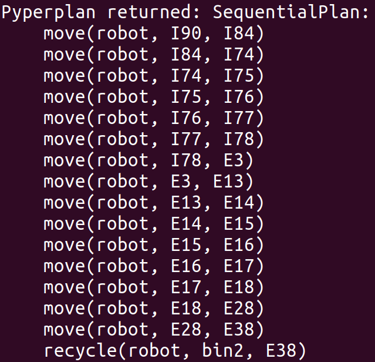

# Planning

*Planning* part implemented using available tools of [AIPlan4EU](https://www.aiplan4eu-project.eu/#project-description-home), a European project which has the aim of boosting the use of planning technologies in as many use-case scenarios as possible.

Our problem was first modeled in *PDDL* and then integrated/translated in *python* for being able to leverage all the planners accessible from the **Unified Planning Framework**. The output plan is the sequence of moves that the user, after knowing which type of garbage holds, has to do in order to reach the nearest and not-full bin.

> An example of produced plan is:

