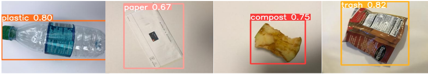

#  Garbage Detection 

*Object detection* neural network based on *YOLOv5* official architecture and finetuned on a custom dataset.

The dataset is available at this link [HRI_RA_dataset](https://universe.roboflow.com/sappia/hri-ra-mtc9l) and it has four categories: **plastic**, **paper**, **compost** and **trash**.

♻ Our model has the ability to recognize and classify different types of waste, providing precise guidance to users regarding where to throw each item. Our social robot **EnvironMate**, employs this perception capability when users ask him where a particular garbage object needs to be placed.

> After making some experiments we decided to employ, at *inference* time, **FP16** half-precision and a **post-pruning** technique of 0.3 scaling factor. This because a good trade-off between inference time and performance of the model was reached. To simulate the interaction with users who show to our robot the object to throw, we randomly select each time an input image from *data/users_imgs*.
